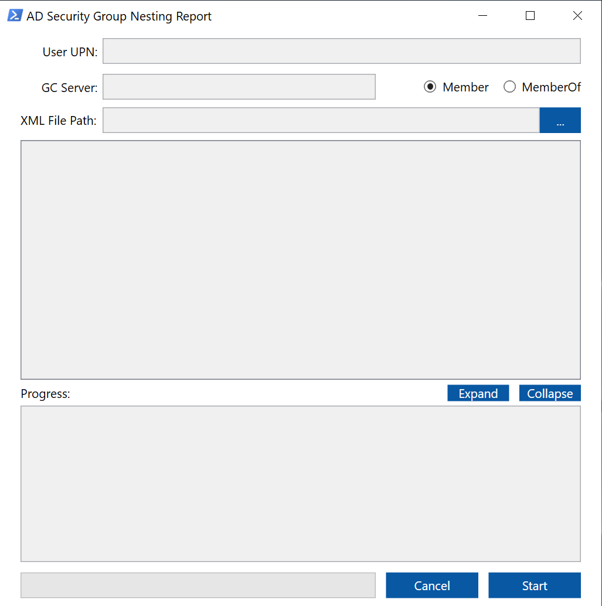

# adgroupnesting-report-tool
This is a script/tool to get all nested **security group** membership/memberof of a user in a domain.

**Disclaimer:** *I am not liable of any damage or data loss when using this script. Please test and study the script first before using it in a production environment.*

## Features
* Multi-domain scan for users that are members of groups accross different domains
* Choose between member or memberof relationships
* Report can be exported to XML
* Responsive WPF GUI with multi-threading
* Displays report to TreeView which includes child count, domain, level of nesting
* Displays scan status on RichTextBox
* Generates report for:
  * Top five groups with most nesting
  * Total number of nested group memberships
  * Total number of duplicate group memberships
* Cancellation of current scan process

## Requirements
* Access to a Global Catalog Server
* Domain user/administrator
* PowerShell v4 or higher
* If using a client PC: RSAT must be installed --> https://www.microsoft.com/en-sg/download/details.aspx?id=45520

## How to use
1. Run the script using PowerShell or PowerShell ISE
2. Provide the required information:
  * UPN - user principal name of the user that will be scanned (username@domain)
  * GC server - global catalog of the forest - this field uses port 3268
  * XML file path - path to save the XML report. Can be left empty if you don't want an XML report
3. Click Start and watch it populate
